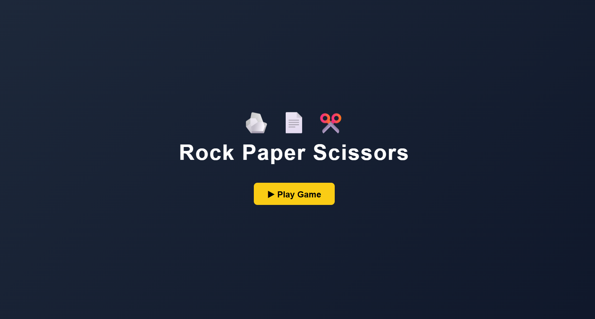
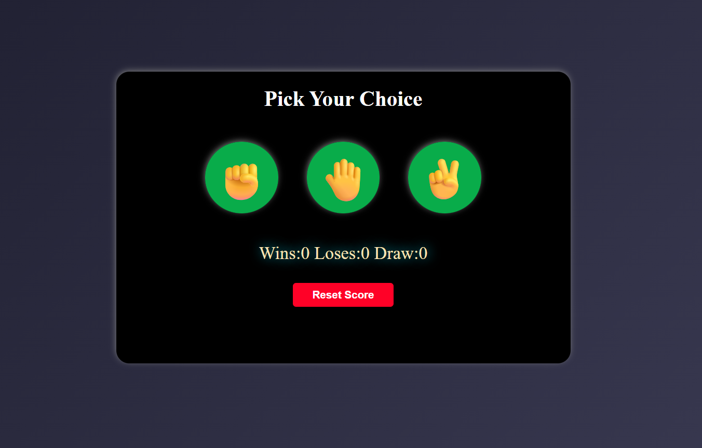

# 🎮 Rock Paper Scissors Game 

A simple and fun **Rock Paper Scissors game** built with **HTML, CSS, and JavaScript**, featuring score tracking and **responsive design**.

---

## 🚀 Live Demo  
🔗 https://askpundir-dev.github.io/rock-paper-scissors-game/

---

## 📌 Features  
- ✊ Choose Rock, 📄 Paper, or ✂️ Scissors
- 🖥️ Computer generates a random move
- 🏆 Score tracking for player and computer
- 📱 Fully responsive design

---

## 🛠️ Tech Stack  
- **HTML5** – Structure  
- **CSS3** – Styling  
- **JavaScript (ES6)** – Game logic & interactivity 

---

## 📸 Screenshots  

### Opening Page 

## Main Gameplay Interface

